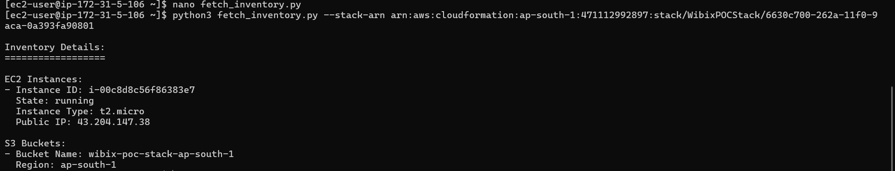

# Wibix Consulting Internship POC

## Project Overview
This Proof of Concept (POC) demonstrates the deployment of an AWS CloudFormation stack in the `ap-south-1` (Mumbai) region, creating an EC2 instance (`t2.micro`, Amazon Linux 2023 AMI, free-tier eligible) and an S3 bucket with read-only access via an IAM role. A Python script (`fetch_inventory.py`) retrieves inventory details (EC2 instance and S3 bucket information) using the stack ARN and instance profile credentials, adhering to AWS best practices by avoiding hardcoded credentials. This project was developed for the Wibix Consulting internship, meeting requirements for a free-tier-compliant solution with a CloudFormation template, Stack Launch URL, Python script, and documentation.

This repository contains all deliverables and is designed to be reproducible for evaluation and public sharing.

## Repository Structure
- `wibix-poc.yaml`: CloudFormation template defining the EC2 instance, S3 bucket, and IAM role.
- `stack_launch_url.txt`: URL to launch the CloudFormation stack.
- `fetch_inventory.py`: Python script to fetch inventory details.
- `README.md`: This documentation, detailing setup, execution, and troubleshooting.

## Prerequisites
To deploy and test this POC, ensure the following:
- **AWS Account**: Free-tier account with permissions for CloudFormation, EC2, S3, and IAM in `ap-south-1`.
- **EC2 Key Pair**: Named `Test` in `ap-south-1` (EC2 Console > Key Pairs).
- **S3 Bucket**: `wibix-poc` in `ap-south-1` with `wibix-poc.yaml` publicly accessible.
- **Execution Environment**: EC2 instance created by the stack, with IAM permissions for:
  - `cloudformation:Describe*`, `cloudformation:List*`
  - `ec2:Describe*`
  - `s3:Get*`, `s3:List*`
- **Python**: Python 3.8+ with `boto3` (`pip install boto3`) on the EC2 instance.
- **GitHub Account**: For uploading the repository.
- **Local Tools**: Git CLI for repository management, SSH client for EC2 access.

## Setup Instructions
Follow these steps to deploy the CloudFormation stack and prepare the EC2 instance.

### 1. Verify EC2 Key Pair
- Navigate to EC2 Console > Key Pairs (`ap-south-1`).
- Ensure a key pair named `Test` exists.
- If not, create one:
  - Name: `Test`, Type: RSA, Format: `.pem`.
  - Download and secure the `.pem` file (`chmod 400 Test.pem`).

### 2. Prepare the CloudFormation Template
- Use the provided `wibix-poc.yaml` (included in this repository).
- Upload to the `wibix-poc` S3 bucket:
  - S3 Console > `wibix-poc` > Upload `wibix-poc.yaml` (overwrite if exists).
  - Make public using ACL or add a bucket policy:
    ```json
    {
      "Version": "2012-10-17",
      "Statement": [
        {
          "Effect": "Allow",
          "Principal": "*",
          "Action": "s3:GetObject",
          "Resource": "arn:aws:s3:::wibix-poc/*"
        }
      ]
    }
    ```
- Verify accessibility: `https://wibix-poc.s3.ap-south-1.amazonaws.com/wibix-poc.yaml`.

### 3. Deploy the CloudFormation Stack
- Open the Stack Launch URL (from `stack_launch_url.txt`):
  ```
  https://console.aws.amazon.com/cloudformation/home?region=ap-south-1#/stacks/new?stackName=WibixPOCStackNew&templateURL=https://wibix-poc.s3.ap-south-1.amazonaws.com/wibix-poc.yaml
  ```
- In CloudFormation Console:
  - **Stack Name**: `WibixPOCStackNew`.
  - **Parameters**:
    - `InstanceType`: `t2.micro`.
    - `KeyName`: `Test`.
    - `S3BucketPrefix`: `wibix-poc`.
    - `S3BucketSuffix`: `stack`.
  - Acknowledge IAM capabilities (`CAPABILITY_IAM`).
  - Create Stack.
- Monitor progress in CloudFormation Console > Stacks > `WibixPOCStackNew` > Events.
- Wait for `CREATE_COMPLETE` (~2-5 minutes).
- Copy the Stack ARN from the Overview tab (e.g., `arn:aws:cloudformation:ap-south-1:471112992897:stack/WibixPOCStack/6630c700-262a-11f0-9aca-0a393fa90801`).

### 4. Prepare the EC2 Instance
- Navigate to EC2 Console > Instances > Select “Wibix-POC-Instance” > Note public IP.
- SSH into the instance:
  ```
  ssh -i Test.pem ec2-user@<public-ip>
  ```
- Install dependencies:
  ```
  sudo dnf update -y
  sudo dnf install python3 -y
  sudo dnf install python3-pip -y
  sudo pip3 install --upgrade pip
  sudo pip3 install boto3
  ```
- If `boto3` installation fails, troubleshoot (see Troubleshooting section).

### 5. Store the Python Script
- Create `fetch_inventory.py` on the EC2 instance:
  ```
  nano fetch_inventory.py
  ```
- Copy the script content from `fetch_inventory.py` in this repository.
- Save (`Ctrl+O`, Enter) and exit (`Ctrl+X`).
- Verify:
  ```
  ls
  ```
  Expected: `fetch_inventory.py`.

## Execution Instructions
1. **Run the Python Script**:
   - On the EC2 instance:
     ```
     python3 fetch_inventory.py --stack-arn arn:aws:cloudformation:ap-south-1:471112992897:stack/WibixPOCStackNew/<uuid>
    ```
    ```
     python3 fetch_inventory.py --stack-arn arn:aws:cloudformation:ap-south-1:471112992897:stack/WibixPOCStack/6630c700-262a-11f0-9aca-0a393fa90801
     ```
   - Replace `<uuid>` with the Stack ARN from the new stack (`WibixPOCStackNew`).
   - Example output:
     ```
     Inventory Details:
     ==================
     EC2 Instances:
     - Instance ID: i-00c8d8c56f86383e7
       State: running
       Instance Type: t2.micro
       Public IP: 43.204.147.38
     S3 Buckets:
     - Bucket Name: wibix-poc-stack-ap-south-1
       Region: ap-south-1
     ```

2. **Verify Output**:
   - Confirm the EC2 instance and S3 bucket details match the stack resources.
   - Errors? See Troubleshooting section.




## Acknowledgments
- Wibix Consulting for providing the internship opportunity.
- AWS for the free-tier resources used in this POC.
---

**Author**: [Ayush Sharma]  
**Date**: May 1, 2025  
**GitHub**: https://github.com/<your-username>/wibix-poc